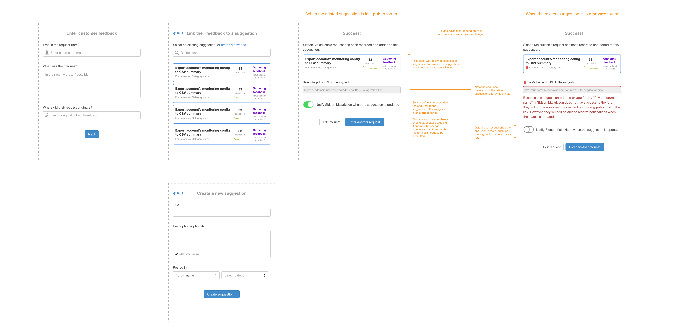
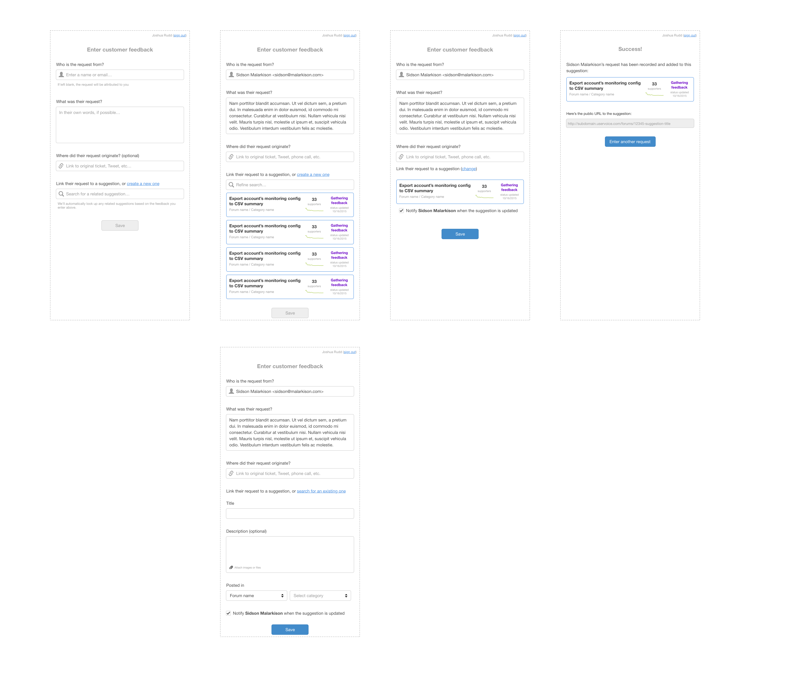
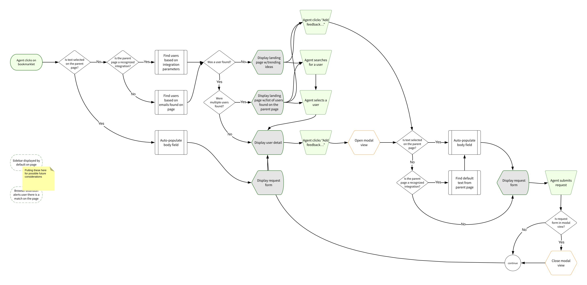
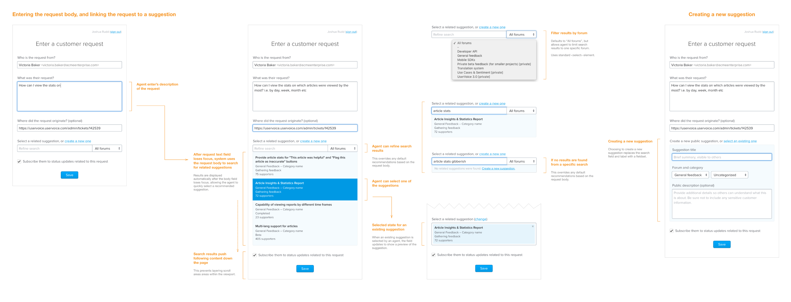
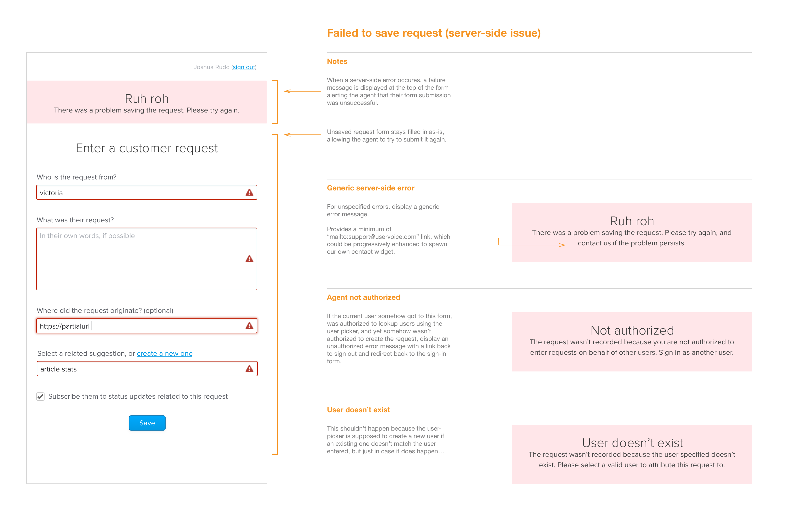
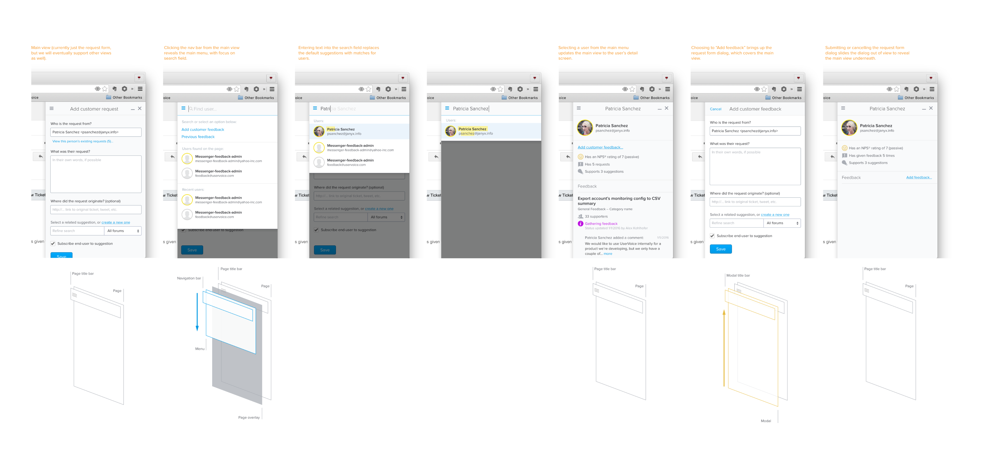

# Case Study: UserVoice Sidebar

## Abstract
- [ ] … Become system of record for all product feedback.

#### Problem
A significant amount of customer feedback was coming through channels other than UserVoice.

- [ ] When product and support/sales would get together to discuss priorities, it would be difficult to determine how much recency bias played in to the feedback they were conveying.
	- “We’re losing sales because we don’t have X.”
	-  “The biggest problem customers have is X.”

1. What are the top issues Sales teams are encountering?
2. What

#### Desired Outcome

- [ ] …

#### Opportunity
Provide a method to capture important feedback from other sources (e.g., support tickets, sales opportunities) into UserVoice.

#### Solution
Create a browser plugin that would allow company employees to capture customer feedback from any webpage, attribute it to the person who gave the feedback, and make it available for other team members in UserVoice.

- [ ] required new license type and supporting user management

## Challenge
UserVoice is a platform for gathering user feedback and making sense of it. From 2008 to 2015, the primary way UserVoice gathered feedback was by allowing companies to set up forums and embed widgets that their end-users could use to submit feedback and vote on ideas.

The more feedback is in UserVoice, the easier it is for teams to discover the top unmet needs of their customers.

However, *UserVoice wasn’t the only way users were submitting feedback.* A significant amount of feedback companies were receiving was coming from channels other than UserVoice – most often through support tickets, chat, sales calls, as well as social media, online reviews, blog comments, etc.

**Insight:** People are going to use whatever method is most accessible and convenient to them in the moment to give feedback.

#### Observations

When a person would give feedback to a sales or support agent, we observed two primary workarounds team members would use to get that feedback into UserVoice:

1. One method was to tell their customer to go to the UserVoice forum to post the same feedback they’d already given. However, telling customers that had already given feedback to give it again using the forum was frustrating to both the customer and the team member. Their customers felt like their feedback was just going to a black hole since the person they were trying to get help from was just redirecting them, and team members reported to us that their customers would often no end up giving the feedback again in UserVoice.
2. Another method we saw was for the team member to create an idea in UserVoice themselves with that customer’s feedback. Unfortunately, the current tools did not allow that feedback to be attributed to the customer who actually gave it (it was instead attributed to the team member who created it), making it difficult to differentiate between internal vs. customer feedback, reducing the value of other insights and segmentation tools.

#### Problem

UserVoice’s customers *wanted* their end-users’ feedback in UserVoice, but did not have effective ways to redirect feedback they were receiving into UserVoice.

How might we allow team members to continue using their existing tools and channels to communicate with customers, while giving them a quick way to add this feedback to UserVoice?

#### Hypothesis

We saw an opportunity to *become the system of record for all product feedback.*

We believed that if we could provide a method for team members capture important customer feedback from within the tools they were already using to communicate with customers, we would see an increase in the amount of customer feedback coming into UserVoice as well as improved quality of that data, giving us the ability to provide better insights for our customers.

##### Business Goals

1. Increase revenue through new business by addressing sales blockers related to capturing customer feedback.
2. Increase renewals by expanding value of UserVoice beyond product teams and into sales and support teams.

##### UX Goals

1. Be invisible to the end-user. People can continue to give feedback using whatever channels are at their disposal, and not have to get redirected to UserVoice in order to make sure their feedback is recorded.
2. Feedback is always attributed to the person who gave it, allowing companies to leverage that data for greater insights.

##### Constraints

Constraints were not known at the beginning of the project, but we soon realized that our initial solution could not require us to rewrite our core data model (yet). This became a big challenge because it resulted in requiring additional steps for the team member capturing the customer’s feedback.

## Roles
This project was unique experience for me because my role changed (due to product and engineering team restructuring) from product manager—where I performed generative research and opportunity assessment for this project—to lead designer as we began ideating, prototyping, and testing our solutions.

As we moved towards building and testing, we formed a team of three engineers, a new product manager, and myself as lead designer. We committed to weekly sprints.

## Process
Generative Research -> Opportunity Assessment -> Discovery -> User Story Mapping -> Prototyping -> Testing -> Iteration

[Illustration of process flow]

### Generative Research

We didn’t set out to solve this problem, but through dozens of ongoing customer interviews discussing how they used the product, what their desired outcomes were, and what challenges they had along the way, some common themes began to emerge. At the time, we were getting close to releasing a major overhaul of our admin tools.

As some patterns emerged, I also met with our Sales and Support execs to see if they’d heard similar feedback from customers and prospects. They did, and offered some valuable insights about how they were trying to achieve the same results using other tools and processes.

### Opportunity Assessment

Once I had a general idea of the unmet needs our customers were having, we needed to decide if this was a problem we should tackle. I’m a huge Marty Cagan fan, and used his template for Product Opportunity Assessments.

> The purpose of a good product opportunity assessment is either to a) prevent the company from wasting time and money on poor opportunities; or b) for those that are good opportunities, to understand what will be required to succeed.

[Assessing Product Opportunities](https://svpg.com/assessing-product-opportunities/), by Marty Cagan

Our assessment set out to answer these 10 questions:

1. Exactly what problem will this solve? (value proposition)
2. For whom do we solve that problem? (target market)
3. How big is the opportunity? (market size)
4. What alternatives are out there? (competitive landscape)
5. Why are we best suited to pursue this? (our differentiator)
6. Why now? (market window)
7. How will we get this product to market? (go-to-market strategy)
8. How will we measure success/make money from this product? (metrics/revenue strategy)
9. What factors are critical to success? (solution requirements)
10. Given the above, what’s the recommendation? (go or no-go)

After reviewing this assessment with the executive team, we decided the project was a go.

### Further discovery

- [ ] Now that we had decided to tackle this problem, we had an endless stream of questions. Each ended up being a series of…

Used UserVoice to identify customers with related problems, and used that list to set up customer calls and on-site interviews.

- [ ] What channels were people primarily using?
	* Zendesk, Salesforce, UserVoice Tickets, Intercom, bespoke solutions

### User Story Mapping

One exercise I use to help get everyone on the same page and is User Story Mapping, a concept coined by Jeff Patton. [^1] I like user story mapping because it helps us focus on the steps necessary for a person to achieve a desired outcome.

We created several user story maps for this project, each for a each person’s job to be done, but the primary one was to answer *How might a team member log a customer’s feedback?*

While usually done on a whiteboard or wall with sticky notes, because some of our team members were remote we decided to user LucidChart to capture and reference the story map.

- [ ] Slice story map into releasable/testable chunks.

### Concept Testing

* What do we need to learn next?
* Focus on most important workflow - getting information into UserVoice

#### Concept 1: Simple form

3 pieces of information

1. Who the feedback was from
2. What their feedback was
3. Where they feedback came from (optional)

##### Bad news from some key customers

This approach would require significant restructuring of our data model, and would also need new admin-facing tools to leverage this data. We decided we’d need to require customers to link related idea.

**Challenge:** this adds a significant step for team members capturing feedback.

While this approach seemed ideal (and we would later come back to this)…

[Revised User Story Map]

#### Concept 2: Multi-step form

User submits data each step of the way, advancing to a new screen for each step

Benefit of form builder was we could automatically display matching ideas based on the feedback rather than the team member clicking *Next.*

[Multi-step form]

#### Concept 3: Dynamic form

Single page form that that includes all necessary steps, revealing new ones only if necessary

[Dynamic form]

* Combined benefit of initial form
* Potential complexity

### Iterative Design & Development

#### Functional Prototype

The purpose of the functional prototype was for the engineering team get a basic walking skeleton [^2] in place as fast as possible. This would give us the basis to start testing our assumptions as quickly as possible, and highlight any risk areas that might require increased effort.

[Annotated wireframes for functional prototype]

[Validation scenarios for functional prototype]

#### Interaction and Visual Design Iterations

While engineering team was building the functional prototype, I began working on iterations for capturing feedback from within existing websites.

Autofill as much data as possible:
1. Email
2. Source URL
3. Feedback

#### 

#### Navigation

### ~~MVP~~ MMP

Minimum Marketable Product

Needed to not only allow any employee at a company to capture customer feedback, but to also create value for our customers with this data.

#### Top Ideas

#### User Management

…

## Outcomes

#### New functionality
1. Bookmarklet
2. Improved user management & invitation flow
3. New license type

#### New source of revenue
UserVoice was losing lots of sales opportunities where prospective customers wanted a tools for sales teams to capture feedback rather than providing a customer-facing feedback tool.

1. Doubled size of new deals. Rather than a handful of user licenses for new business, we started getting deals for hundreds of licenses.
2. Expansion/revenue model. Lead to new deals and expansion.

#### Foundation for new features
New channel that opened up opportunities for UserVoice to provide additional value to customers - internal status, roadmap, etc.

## Learnings and insights

1. Employees didn’t have time to figure out how to organize the feedback. Only ask for what the team member knows.
2. MVP bookmarklet was not enough. Difficulty installing. Users didn’t remember to open it.
3. Ideas for next time
	1. Opportunities to push information to team members - such as status of feedback they captured.
	2. Find ways to reduce time for entry - not require idea linking.
	3. Rethink data model - not requiring ideas, ability to attribute feedback to organizations rather than just individuals…
	4. Standalone UI - capturing feedback from phone calls didn’t originate from a webpage, so invoking a bookmarklet didn’t make sense.
	5. SSO - sales and support teammates were already signed in to tools like Zendesk and Salesforce. Requiring them to also sign in to UserVoice with separate credentials seemed like an unnecessary step and a barrier for entry for some.

## Appendix

*For each customer call, I’d summarize learnings and create ideas in UserVoice but, just like the problems our customers expressing, I wasn’t able to easily capture quotes and feedback from those calls in UserVoice in a way that would make it easy to attribute that feedback to the customer.*

*Internally, we were also running into our own issue for how to prioritize our product initiatives. When the leadership team would get together to discuss the top product improvements each team wanted, it was difficult to determine what was biased by recency. Sales would say they were losing deals because of “X”, and Support would say the biggest problem customers had was “Y”, but none of these could be backed up by the feedback we had in our system that customers had submitted directly.*

- [ ] Timeline, year

### Materials list
1. LucidChart - User Story Mapping [1] & User flows
2. Sketch - Wireframes & Mockups
3. InVision - Internal Feedback & Prototyping
4. Principle for Mac - Prototyping & Animation

### Footnotes
[^1]: [User Story Mapping](https://www.jpattonassociates.com/user-story-mapping/) by Jeff Patton
