# Case Study: UserVoice Sidebar

UserVoice was one the first web services to help companies collect feedback directly from customers through in-app widgets and feedback forums, but a significant amount of feedback was still being received through other sales and support channels customer-facing teams used, leaving a significant gap in the amount of feedback product teams had access to.

To address this, UserVoice created a browser plugin that allowed customer-facing teams to capture customer feedback from any webpage, attribute it to the person who gave the feedback, and make it available for other team members in UserVoice – giving product teams the data they needed to make informed decisions.

**Position**

- Director, User Experience

**Company**

* UserVoice

**Responsibilities**

* Generative Research
* Concept Testing
* UX/UI Design
* User Testing

**Tools**

- LucidChart
- Sketch
- InVision
- Principle

**Date**

* 2015-2016

## The Challenge
### Background

UserVoice is a platform for gathering user feedback and making sense of it. From 2008 to 2015, the primary way UserVoice gathered feedback was by allowing companies to set up forums and embed widgets that their end-users could use to submit feedback and vote on ideas.

The more feedback companies have in UserVoice, the easier it is for them to discover the top unmet needs of their customers.

However, *UserVoice wasn’t the only way users were submitting feedback.* A significant amount of feedback companies were receiving was coming from channels other than UserVoice – most often through support tickets and sales calls, but also through chat, social media, online reviews, blog comments, and more.

### Observations

People are going to use whatever method is most accessible and convenient to them in the moment to give feedback.

When someone would request a feature or give feedback directly to a sales or support agent rather than submitting it through UserVoice, we observed two primary workarounds team members would use to get that feedback into UserVoice.

One method was to tell their customer to go to the UserVoice forum to post the same feedback they’d already given. However, telling customers that had already given feedback to give it again using the forum was frustrating to both the customer and the team member. Their customers felt like their feedback was just going to a black hole since the person they were trying to get help from was just redirecting them, and team members reported to us that their customers would often no end up giving the feedback again in UserVoice.

Another method we saw was for the team member to create an idea in UserVoice themselves with that customer’s feedback. Unfortunately, the current tools did not allow that feedback to be attributed to the customer who actually gave it (it was instead attributed to the team member who created it), making it difficult to differentiate between internal vs. customer feedback, reducing the value of other insights and segmentation tools.

Also, when product and support/sales would get together to discuss priorities, it would be difficult to determine how much recency bias played in to the feedback they were conveying. Sales would say, “We’re losing sales because we don’t have X,“ and support would say, “The biggest problem customers have is Y,” but there was no meaningful data to back it up.

### The Problem

Product teams didn’t trust the information that they were getting from sales teams. Sales teams didn’t feel like product was listening to them.

UserVoice’s customers *wanted* their customers’ feedback in UserVoice, but did not have effective ways to redirect feedback they were receiving into UserVoice.

How might we allow team members to continue using their existing tools and channels to communicate with customers, while giving them a quick way to add this feedback to UserVoice?

### Hypothesis

==We saw an opportunity to *become the system of record for all product feedback.*==

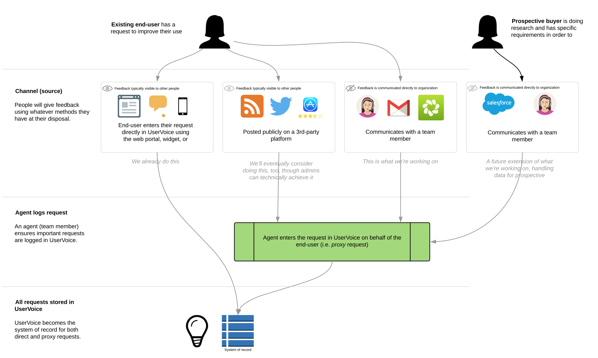

We believed that if we could provide a method for team members capture important feedback from customers within the same tools they were already using to communicate with customers, we would see 1) an increase in the amount of product feedback coming into UserVoice, and 2) improved quality of that data. With these, we could provide better insights for product teams, and empower them to make data-driven decisions.

### Business Goals

1. Increase revenue through new business by addressing the increasing number of sales blockers related to capturing customer feedback.
2. Increase UserVoice’s average selling price (ASP).
3. Reduce churn by expanding the value and usage of UserVoice beyond product teams.

### Design Goals

1. Be invisible to the end-user. People can continue to give feedback using whatever channels are at their disposal, and not have to get redirected to UserVoice in order to make sure their feedback is recorded.
2. Feedback is always attributed to the person who gave it, allowing companies to leverage that data for greater insights.

### Constraints

Constraints were not known at the beginning of the project, but we soon realized that our initial solution could not require us to rewrite our core data model (yet). This became a big challenge because it resulted in requiring additional steps for the team member capturing the customer’s feedback.

## Role
This project was unique experience for me because my role changed (due to product and engineering team restructuring) from product manager—where I performed generative research and opportunity assessment for this project—to lead designer as we began ideating, prototyping, and testing our solutions.

As we moved towards building and testing, we formed a team of three engineers, a new product manager, and myself as lead designer. We committed to weekly sprints.

## Process

1. Generative research
2. Opportunity assessment
3. Further discovery
4. User Story Mapping
5. Concept testing
6. Iterative design and development
7. MMP

### Generative Research

In the spring and summer of 2015, while testing a major overhaul of our admin tools, I spent a considerable amount of time conducting customer interviews to learn how they used the product, what their teams’ workflows were, how UserVoice helped them get their job done, and what challenges they had along the way.

When a customer would bring up an issue or make a request, I’d follow up with the following questions:

- What is your suggested solution?
- What goal does this help you achieve?
- What are you doing today to achieve/overcome it?

While customers’ suggested solutions were most often not how we’d address their problems, it did give us big insight into what *they* thought would be helpful. Additional *why* questions helped reveal the root of the issue – but ==the biggest eye openers were always *learning what their goals were,* and *what they were doing today to achieve their goals.*== If we could help them achieve their goals faster and more effectively, then there might be an opportunity for us.

Several themes emerged very quickly during this research. Our sales and support execs said they’d heard similar feedback from customers and prospects, and offered valuable insights about how additional customers and prospective buyers were trying to achieve similar results.

### Opportunity Assessment

> The purpose of a good product opportunity assessment is either to a) prevent the company from wasting time and money on poor opportunities; or b) for those that are good opportunities, to understand what will be required to succeed.

*[Assessing Product Opportunities](https://svpg.com/assessing-product-opportunities/), by Marty Cagan*

Once I had a general idea of the unmet needs our customers were having, we needed to decide if this was a problem we should tackle. I’m a huge Marty Cagan fan, and used his template for Product Opportunity Assessments.

Our assessment set out to answer these 10 questions:

1. Exactly what problem will this solve? (value proposition)
2. For whom do we solve that problem? (target market)
3. How big is the opportunity? (market size)
4. What alternatives are out there? (competitive landscape)
5. Why are we best suited to pursue this? (our differentiator)
6. Why now? (market window)
7. How will we get this product to market? (go-to-market strategy)
8. How will we measure success/make money from this product? (metrics/revenue strategy)
9. What factors are critical to success? (solution requirements)
10. Given the above, what’s the recommendation? (go or no-go)

After reviewing this assessment with the executive team, we decided the project was a go.

### What do we need to learn next?

Now that we had decided to tackle this opportunity, we had an endless stream of questions.

Using the feedback we already had in our own UserVoice account I was able to identify customers with related unmet needs, and used that list to set up customer calls and on-site interviews.

One of the initial questions we had was, **What tools are sales and support teams already using to communicate with customers?**

We learned that Zendesk and Salesforce were at the most common tools, but there were so many others (including UserVoice Tickets, Intercom, Gmail, and bespoke solutions) that we felt like creating an integration with a single product might limit the number of customers we could deliver a solution for.

We decided to build a basic solution that could work anywhere, and focus on tighter integrations later. Now we just needed to figure out what that experience would be.

### User Story Mapping

One exercise I use to help get PMs, designers, and engineers on the same page is User Story Mapping, a concept coined by Jeff Patton. [^1] ==I like user story mapping because it helps the team focus on the steps necessary for a person to achieve their desired outcome.==

[^1]: [User Story Mapping](https://www.jpattonassociates.com/user-story-mapping/) by Jeff Patton

We identified four primary personas/roles impacted by this project and created user story maps for each:

1. The Customer
2. The Support Agent
3. The Support Manager
4. The Product Manager

The primary one was to answer *How might a support agent log customer feedback?*

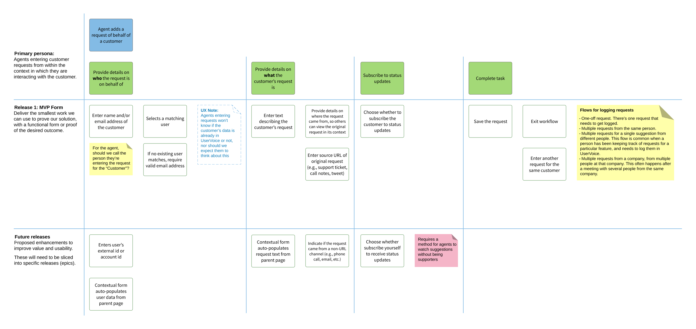

(I prefer to create user story maps on a whiteboard or wall with sticky notes, but because some of our team members were remote we decided to use LucidChart so everyone could contribute and reference it.)

Once we got all the tasks, risks, and questions down, we “sliced” them into releasable/testable chunks, prioritized by what we needed to learn next.

### Concept Testing

Once we had the user story map, our engineers were able to start exploring a lot of the technical requirements needed to deliver a solution, and I set out to put together some quick wireframe concepts to test both internally and with select customers.

#### Concept 1: Simple form

The first concept focussed on only asking support agents for the most essential information needed: [^2]

[^2]: Behind the scenes, we also knew who was logging the feedback on behalf of the customer, but we didn’t need to ask for this information.

1. **Who** the feedback was from.
2. **What** their feedback was.
3. **Where** they feedback came from (optional).

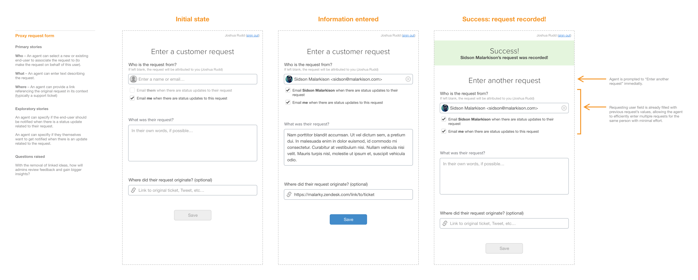

##### Pros

1. This experience required minimal interaction and could be delivered very quickly.
2. Support agents only had to provide information they already had.
3. In many cases we could automatically populate every field for them.

##### Cons

However, this direction would introduce some risk factors with the existing data model that would also require us to create new admin-facing tools. While we ultimately felt we needed to also simplify our data model, we weren’t confident this was the right time to do it. [^3]

[^3]: Up to this point, the primary object in UserVoice were aggregate *ideas,* which were essentially forum topics that could be voted and commented on by others. The kind of feedback support agents would be logging were private and would not be visible to other customers. And at the time, there wasn’t any UI for managing large sets of uncategorized bits of feedback.

In addition, two of our key customers wanted their support agents to link the feedback they were logging to existing ideas in their UserVoice accounts. Without other admin-facing tools to leverage feedback not linked to ideas This approach would require significant restructuring of our data model, and would also need new admin-facing tools to leverage this data.

##### Takeaway

While we preferred the UX of this direction most, we would have to rework a lot of our infrastructure to deliver valuable insights for our customers. We ultimately wanted to do this work, but it wasn’t the right time.

We decided to require support agents to link feedback to a related idea, so we went back to our user story map and added some additional tasks.

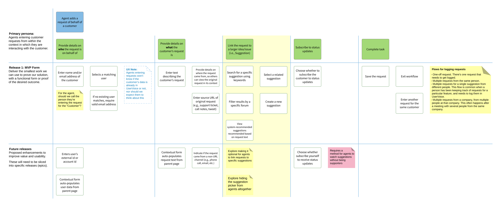

#### Concept 2: Multi-step form

For the next concept, we tried to keep the simplicity of the first one, but add a second step which would ask the support agent to link to a related idea, or create a new idea if an existing one didn’t exist.

This flow was somewhat similar to our end-user-facing widget, which would ask the person to enter their feedback, click next, and then display a list of related ideas (if any existed). If one did, they could vote for it instead of creating a new idea in the system.

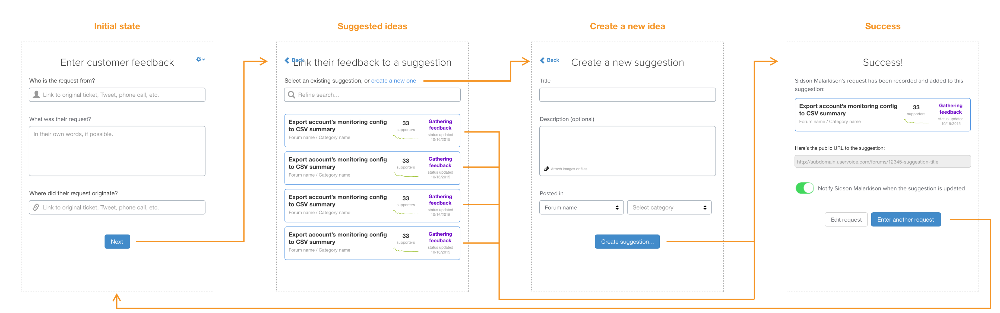

##### Pros

1. Similar experience to end-user-facing widget.
2. Less visual complexity than Concept 3 on each step of the form.

##### Cons

1. It wasn’t obvious to testers that there was a second step, or how many more steps there would be.
2. Initial engineering estimates were higher than we hoped.

#### Concept 3: Dynamic form

The third concept was created in tandem with the second, but focussed on providing a single-page form that displayed related ideas on the same screen as the feedback field.

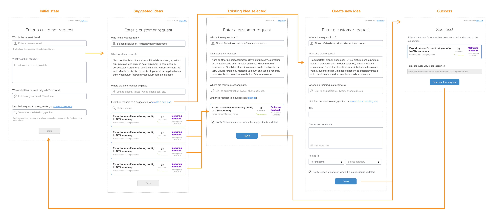

*Concept 3: Dynamic form*

##### Pros

1. Agent could see all fields they needed to enter on a single screen.
2. In cases where the feedback field was auto-populated, we could immediately display related ideas rather than the support agent having advance the form (in Concept 2).

##### Cons

1. Would require a lot more fitness and conditional logic to get the interaction and experience just right.
2. Potentially confusing experience switching between linking an existing idea and creating a new one.

##### Decision

Based on the perceived need to require support agents to link feedback to an idea, and positive tests both internally and with customers, we decided to move forward with the third concept for our first functional implementation.

### Iterative Design & Development

#### Functional Prototype

Alongside the concept work, the engineering team starting working on a “walking skeleton” [^4] version of the support agent’s experience. Our initial focus was just on what was necessary for the support agent to successfully log their customer’s feedback so we could start testing our assumptions on the experience as quickly as possible, and highlight any risk areas.

[^4]: (Define walking skeleton…)

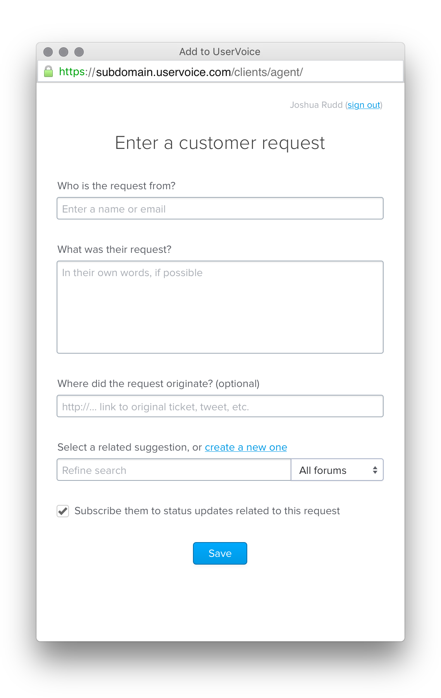

In addition to getting content into the system, we also began thinking through all the scenarios where things could go wrong for the person logging feedback, and how to guide them towards success.

#### Interaction and Visual Design Iterations

While engineering team was building the functional prototype, I began working on iterations for capturing feedback from within existing websites.

The idea was that support agents (and other team members) would be able to log customer feedback from any website, so we decided to go with a minimal “sidebar” experience.

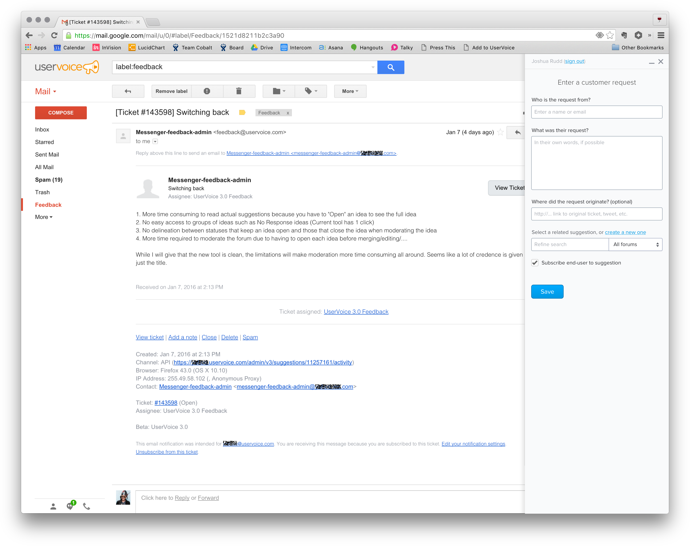

I also started thinking through how people might need to interact with the sidebar in relation to the browser window – minimizing it access content beneath it, popping it out into another window, etc.

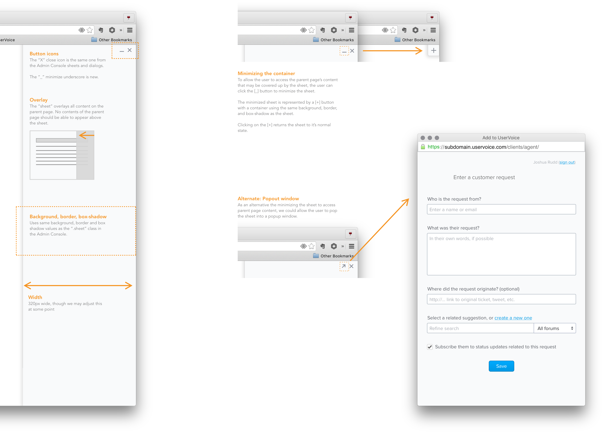

It also became clear that we could auto-populate most of the data the support agent needed to fill in to the form by pulling that information from the website, including:

1. Email
2. Source URL
3. Feedback

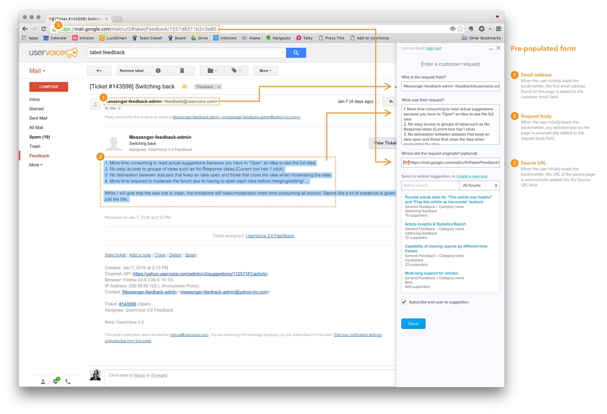

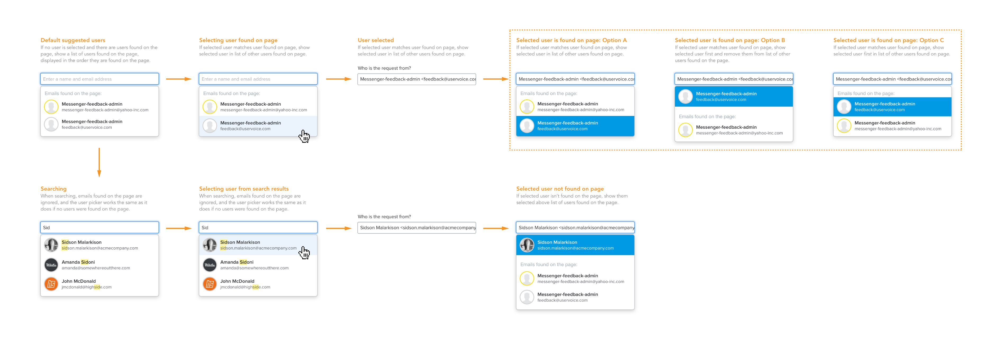

In addition to auto-populating content, we realized there were other opportunities to bring more value to the person using the sidebar by pulling relevant data from UserVoice into their current context (I.e., email or support ticket). For example, we could show them what feedback the person they were talking to already has, so they could understand what challenges their customer is having and provide better support.

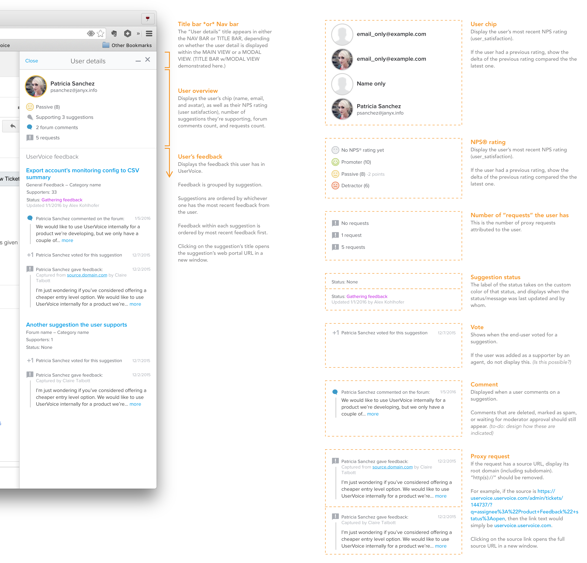

Of course, now that we were doing more than just allowing support agent to log customer feedback, we needed to start thinking about how they would navigate between all this information.

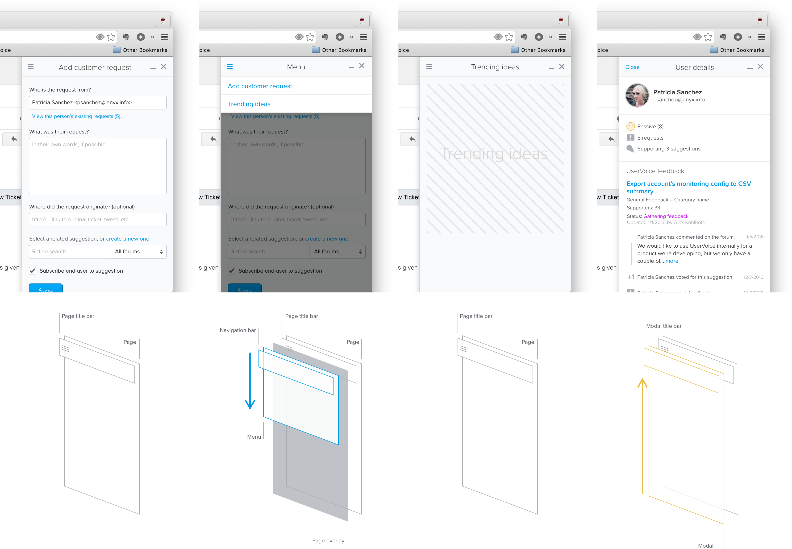

### ~~MVP~~ MMP (Minimum Marketable Product)

While all this functionality was great, and many of our beta customers were starting to use this new functionality, we still didn’t have a meaningful way to demonstrate the value of having all this new data in UserVoice.

The ultimate goal of having other departments log customer feedback in UserVoice was so that product teams could make more informed decisions about what to prioritized.

Since we wanted these departments to also be able to see this data, we decided to start by displaying how ideas were trending in the sidebar.

#### Top Ideas

As I set out to work on this problem, I started by focussing on how we could display the top ideas more visually.

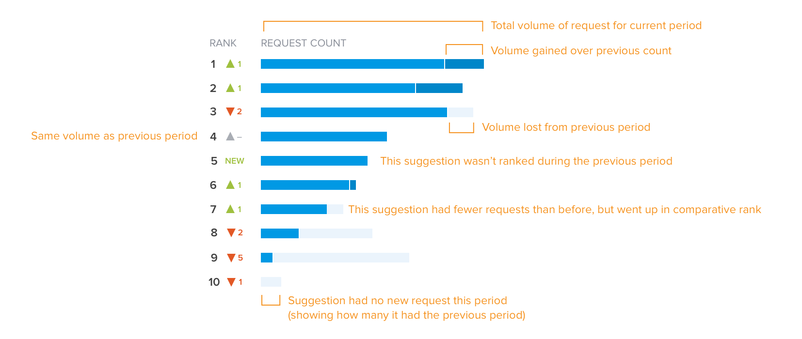

Because ideas need a bit of content, such as what forum & category they belong to, as well as current status, I came up with this design:

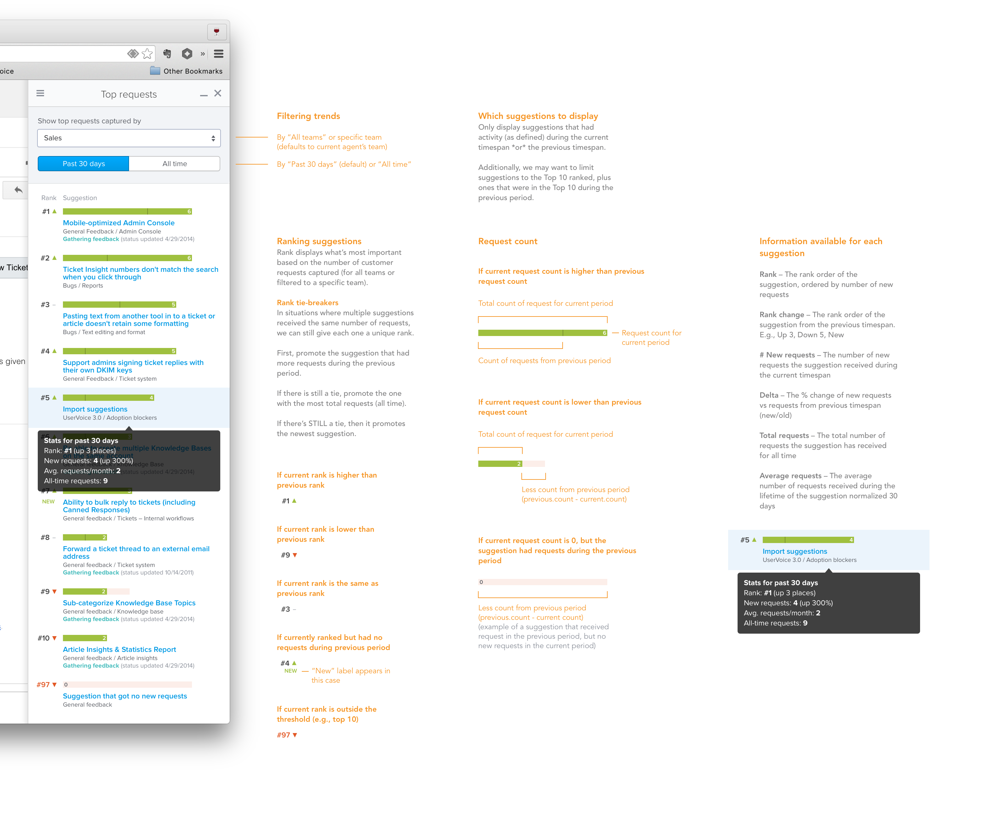

However, because of time, we decided we needed to pair down the visuals and focus on delivering just the content first:

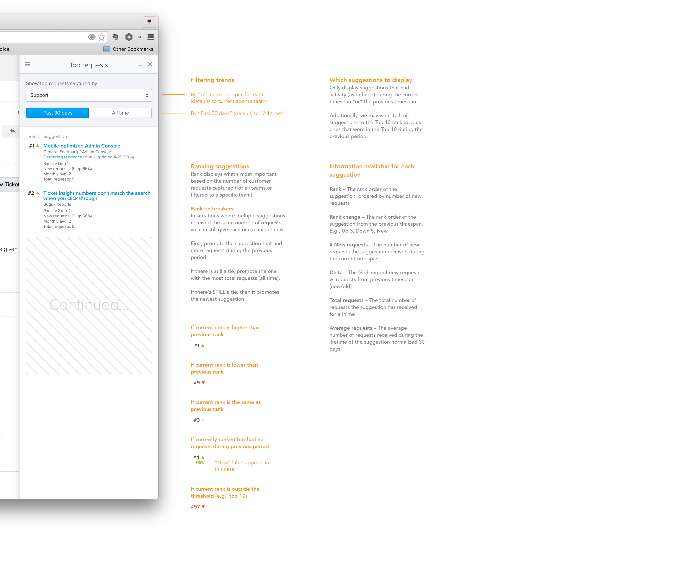

People using the sidebar could also see the overall top ideas, or filter them down by team and time.

#### User Management

I also led discovery and design for two additional related projects that were needed to get the UserVoice Sidebar to marketable release:

1. Team management
2. New user licenses and permission management

Team management allowed companies to categorize team members by department (or team), and enabled us to deliver the Top Ideas report, showing the top ideas by team/department.

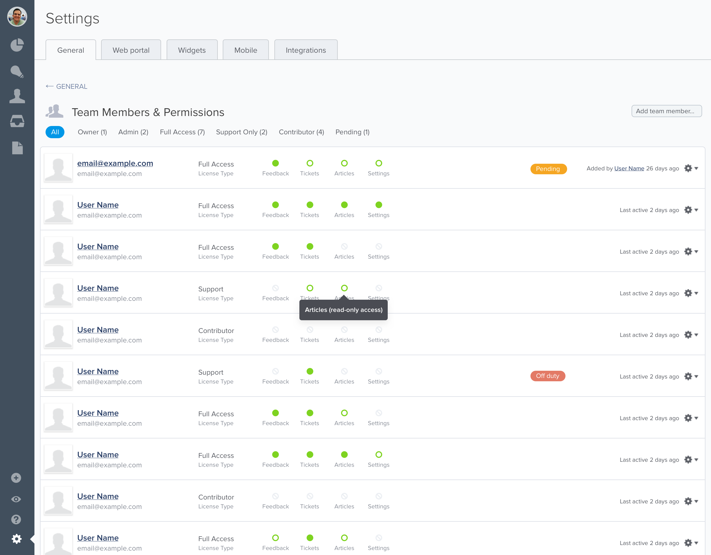

And, because we wanted to sell a new, less expensive license type for “Contributors” who could have access to the new sidebar but not all of the other admin tools our customers usually used, we needed a way for account admins to invite contributors and manage permissions.

I won’t go into all the details of those additional projects at this time.

## Outcomes

This was one of the most exciting projects I worked on at UserVoice, most in part because it solved a major shortcoming of our existing platform and opened up a path for us to become the system of record of all product feedback for our customers. 

**More feedback**

Companies that rolled out the sidebar saw the amount of feedback coming into their systems double.

**New functionality**

1. “UserVoice Sidebar” - installed via bookmarklet on any browser
2. Improved user management & invitation flow
3. New license type

**New source of revenue**

1. Doubled size of new deals. Rather than a handful of user licenses for new business, we started getting deals for hundreds of licenses.
2. Expansion/revenue model. Lead to new deals and expansion.

**A foundation for new features**

Shortly after releasing the sidebar via a browser bookmarklet, we created first class integrations with Zendesk and Salesforce. We also started building ways to improve internal communication between product teams and other departments using the sidebar experience.

## Learnings and insights

You learn a lot after releasing something into the wild. Some of what we learned was:

1. Only ask people for what they know. When logging a customer’s feedback, support agents didn’t have time to figure out how to organize the feedback. The step we added based on early feedback to require support agents to link it to an idea lead to 1) added time for form completion, 2) the creation of duplicate ideas, 3) team members creating ideas for their own solutions that didn’t accurately reflect the customer’s problem.
2. People didn’t remember to open the sidebar via bookmarklet. We addressed this for Zendesk and Salesforce customers through tight integrations, and planned to eventually create browser extensions that could help remind and further automate the logging of customer feedback.

### Ideas for next time

1. Find opportunities to push information to back to team members – such as status of feedback they captured.
2. Find ways to reduce time for entry – not require idea linking. (We did start working on this a few years later.)
4. Standalone UI – capturing feedback from phone calls didn’t originate from a webpage, so invoking a bookmarklet didn’t make sense.
5. SSO – sales and support teammates were already signed in to tools like Zendesk and Salesforce. Requiring them to also sign in to UserVoice with separate credentials seemed like an unnecessary step and a barrier for entry for some.

## Appendix

*For each customer call, I’d summarize learnings and create ideas in UserVoice but, just like the problems our customers expressing, I wasn’t able to easily capture quotes and feedback from those calls in UserVoice in a way that would make it easy to attribute that feedback to the customer.*

*Internally, we were also running into our own issue for how to prioritize our product initiatives. When the leadership team would get together to discuss the top product improvements each team wanted, it was difficult to determine what was biased by recency. Sales would say they were losing deals because of “X”, and Support would say the biggest problem customers had was “Y”, but none of these could be backed up by the feedback we had in our system that customers had submitted directly.*

## Endnotes
